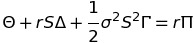

```{r, echo=FALSE}
knitr::opts_chunk$set(collapse=TRUE,                # hadley
                      comment = "#>",               # hadley
                      error=TRUE, purl=FALSE,       # to be able to see errors
                      fig.width=7.25, fig.height=6) # nice-sized pictures
```

```{r library}
library(ustreasuries)
```

* ## **EuroCall** Calculate the price of a European call option with or without dividends
* ## **EuroPut** Calculate the price of a European put option with or without dividends
```{r eurocallput}
# Hull 7th edition Ch 13 P 294
Stock     <- 42    # S_0
Exercise  <- 40    # K
Time      <- 0.50  # T
Interest  <- 0.10  # r
Yield     <- 0     # q
sigma     <- 0.20  

ans_c <- EuroCall(Stock, Exercise, Time, Interest, Yield, sigma)
ans_p <- EuroPut(Stock, Exercise, Time, Interest, Yield, sigma)

writeLines(paste0("c = ", round(ans_c,2), ", p = ", round(ans_p,2)))
```
-------------------------------------------------------------------------------

# Greeks   
### Relationship between Delta, Theta and Gamma


* ## **DeltaCall** Change in call-option price given change in asset price
```{r deltacall}
# Hull, 7th edition Ch 17 p 363
library(ustreasuries)
Stock    <- 49
Exercise <- 50
Time     <- 20/52
Interest <- 0.05
Yield    <- 0
sigma    <- 0.20
ans <- DeltaCall(Stock, Exercise, Time, Interest, Yield, sigma)
writeLines(paste0("Delta call: when the asset price changes by Delta_S,\n",
                  "                the option price changes by Delta_S*",round(ans, 3)))
```
* ## **DeltaPut** Change in put-option price given change in asset price
```{r deltaput}
# Hull, 7th edition Ch 17 p 362,3
Stock    <- 49     # S_0
Exercise <- 50     # K
Time     <- 20/52  # T
Interest <- 0.05   # r
Yield    <- 0      # q
sigma    <- 0.20

dcall <- DeltaCall(Stock, Exercise, Time, Interest, Yield, sigma)
dput  <- DeltaPut(Stock, Exercise, Time, Interest, Yield, sigma)

writeLines(paste0("Delta put: when the asset price changes by Delta_S,\n",
               "               the option price changes by Delta_S*",round(dput, 3),
               "\nDelta put = Delta call - 1? ", dput == dcall-1))
```

```{r deltaplot}
x_axis      <- c()
y_axis_call <- c()
y_axis_put  <- c()
for (Stock in seq(0, 100)) {
    x_axis <- c(x_axis, Stock)
    y_axis_call <- c(y_axis_call, DeltaCall(Stock, Exercise, Time, Interest, Yield, sigma))
    y_axis_put  <- c(y_axis_put, DeltaPut(Stock, Exercise, Time, Interest, Yield, sigma))
}
plot(x_axis, y_axis_call, ylim=c(-1.5,1.5), type="l",col="red",
     xlab="Stock Price", ylab="Delta",
     main="Variation of Delta with Asset Price",
     sub="K = 50, r = 5%, q = 0, sigma = 20%")
lines(x_axis, y_axis_put,col="blue")

abline(h=0)
abline(h=-1, lty=2)
abline(h=1, lty=2)
legend("topright",c("DeltaCall","DeltaPut"),lty=c(1,1),col=c("red","blue"))
abline(v=Exercise)
text(x=Exercise, y=-1.25, labels="K", cex=1.25)
#dev.copy(png,filename="../Wiki_images/deltaplot.png");
#dev.off ();
```   

* ## **ThetaCall** the decay in the value of a call or a portfolio of calls as time passes   
* ## **ThetaPut** the decay in the value of a put or a portfolio of puts as time passes
```{r thetacallput}
# Hull, 7th edition Ch 17 p 367
Stock    <- 49     # S_0
Exercise <- 50     # K
Time     <- 20/52  # T
Interest <- 0.05   # r
Yield    <- 0      # q
sigma    <- 0.20

thcall <- ThetaCall(Stock, Exercise, Time, Interest, Yield, sigma)
thput  <- ThetaPut(Stock, Exercise, Time, Interest, Yield, sigma)

rKe    <- Interest * Exercise * exp(-Interest*Time)
#--------------------------------------------------------------------

writeLines(paste0("ThetaCall:        ", round(thcall, 2), "\n",
                  "ThetaPut:         ", round(thput, 2),   "\n",
                  "per calendar day: ", round(thcall/365, 4), " (call)", "\n",
                  "per trading day:  ", round(thcall/252, 4), " (call)", "\n\n",
    "ThetaPut is always greater than ThetaCall by an amount rKe:", "\n",
    "Diff: ",thput-thcall,"\n",
    "rKe:  ",rKe))
```
```{r thetacallplotstockprice}
x_axis      <- c()
y_axis_call <- c()
y_axis_put  <- c()
for (Stock in seq(0, 100)) {
    x_axis <- c(x_axis, Stock)
    y_axis_call <- c(y_axis_call, ThetaCall(Stock, Exercise, Time, Interest, Yield, sigma))
    y_axis_put  <- c(y_axis_put, ThetaPut(Stock, Exercise, Time, Interest, Yield, sigma))
}

plot(x_axis, y_axis_call, type="l", col="black",
     xlab="Stock Price", ylab="Theta",
     ylim=c(floor(min(y_axis_call)), ceiling(max(y_axis_put))),
     main="Variation in Theta as Stock Price Changes",
     sub=expression(paste0("K = 50, r = 5%, q = 0 ", sigma, " = 20%")))

abline(v=Exercise)
text(x=Exercise, y=0, labels="K", cex=1.5)

abline(h=0, lty=2)

abline(h=-Interest*Exercise*exp(-Interest*Time), lty=2)
text(x=5, y=-Interest*Exercise*exp(-Interest*Time), pos=3, labels=expression(-rKe^{-rT}))

lines(x=x_axis, y=y_axis_put, lty=5, col="red")

legend("topright",c("ThetaPut","ThetaCall"),lty=c(5,1),col=c("red","black"))
#dev.copy(png,filename="../Wiki_images/thetacall.png");
#dev.off ();
```
* ## **OptionGamma** the change in Delta with respect to asset price
```{r gamma}
# Hull, 7th edition Ch 17 p 371,2
Stock    <- 49     # S_0
Exercise <- 50     # K
Time     <- 20/52  # T
Interest <- 0.05   # r
Yield    <- 0      # q
sigma    <- 0.20

gamma <- OptionGamma(Stock, Exercise, Time, Interest, Yield, sigma)
round(gamma, 3) # 0.066
```

```{r gammaplot}
x_axis <- c()
y_axis <- c()
for (Stock in seq(0, 100)) {
    x_axis <- c(x_axis, Stock)
    y_axis <- c(y_axis, OptionGamma(Stock, Exercise, Time, Interest, Yield, sigma))
}

plot(x_axis, y_axis, type="l", col="black",
     xlab="Stock Price", ylab="Gamma",
     main="Variation in Gamma as Stock Price Changes",
     sub="K = 50, r = 5%, q = 0, sigma = 20%")

abline(v=Exercise)
text(x=Exercise, y=0.01, labels="K", cex=1.5)

#dev.copy(png,filename="../Wiki_images/gamma.png");
#dev.off ();
```   

--------------------------------------------------------------------------------

* ## **Vega** the sensitivity to changes in the volatility of the underlying
```{r vega}
# Hull, 7th edition Ch 17 p 375
Stock    <- 49     # S_0
Exercise <- 50     # K
Time     <- 20/52  # T
Interest <- 0.05   # r
Yield    <- 0      # q
sigma    <- 0.20

vega <- Vega(Stock, Exercise, Time, Interest, Yield, sigma)

writeLines(paste0("The value of Vega is ", round(vega,1),   "\n",
"Therefore, a 1% change in the volatility from 20% to 21%", "\n",
"will raise the price of the option by this amount:",       "\n",
"1% x ", round(vega,1), " = ", round((0.01 * vega), 3),
", from ", Stock, " to ", Stock+round((0.01 * vega), 3)))
```

```{r vegaplotprice}
x_axis <- c()
y_axis <- c()
for (Stock in seq(0, 100,0.01)) {
    x_axis <- c(x_axis, Stock)
    y_axis <- c(y_axis, Vega(Stock, Exercise, Time, Interest, Yield, sigma))
}

plot(x_axis, y_axis, type="l", col="black",
     xlab="Stock Price", ylab="Vega",
     main="Variation in Vega as Stock Price Changes",
     sub="K = 50, r = 5%, q = 0, sigma = 20%")

abline(v=Exercise)
text(x=Exercise, y=0.01, labels="K", cex=1.5)

#dev.copy(png,filename="../Wiki_images/vegaprice.png");
#dev.off ();
```   

```{r vegaplotsigma}
Stock    <- 49     # S_0
x_axis <- c()
y_axis <- c()
for (sigma in seq(0.05, 0.75, 0.01)) {
    x_axis <- c(x_axis, sigma)
    y_axis <- c(y_axis, Vega(Stock, Exercise, Time, Interest, Yield, sigma))
}

plot(x_axis, y_axis, type="l", col="black",
     xlab="sigma", ylab="Vega",
     main="Variation in Vega as Volatility Changes",
     sub="K = 50, r = 5%, q = 0, S = 49")
abline(h=12.10548, lty=2)
abline(v=0.20,     lty=2)

#dev.copy(png,filename="../Wiki_images/vegasigma.png")
#dev.off ()
```   

* ## **RhoCall** the sensitivity to changes in risk-free rate of interest
```{r rhocall}
# Hull, 7th edition Ch 17 p 376
Stock    <- 49     # S_0
Exercise <- 50     # K
Time     <- 20/52  # T
Interest <- 0.05   # r
Yield    <- 0      # q
sigma    <- 0.20

rho <- RhoCall(Stock, Exercise, Time, Interest, Yield, sigma)
round(rho, 2) # 8.91
```

```{r rhoplotprice}
x_axis <- c()
y_axis <- c()
for (Stock in seq(0, 100,0.01)) {
    x_axis <- c(x_axis, Stock)
    y_axis <- c(y_axis, RhoCall(Stock, Exercise, Time, Interest, Yield, sigma))
}

plot(x_axis, y_axis, type="l", col="black",
     xlab="Stock Price", ylab="RhoCall",
     main="Variation in RhoCall as Stock Price Changes",
     sub="K = 50, r = 5%, q = 0, sigma = 20%")

abline(v=Exercise)
text(x=Exercise, y=0.01, labels="K", cex=1.5)

#dev.copy(png,filename="../Wiki_images/rhoprice.png");
#dev.off ();
```   


